<div align="center">


<br/>

[](#-tech-stack)
[](#-api)
[](#-data-model)
[](#-mcp-servers--plug-argus-into-any-ai-agent)
[](#-architecture)

**12,202,942 watchlist records · 800 live sources · 561 agencies · 90+ jurisdictions · one API call**

[Why Argus](#-why-argus) · [Live demo](#-see-it-work) · [Coverage](#-coverage) · [Architecture](#-architecture) · [API](#-api) · [Engineering](#-engineering-deep-dive) · [Quickstart](#-quickstart)

</div>

---

## ◎ What is Argus?

In Greek myth, **Argus Panoptes** was the giant with a hundred eyes, some of which were always awake. This system follows the same idea for financial crime.

**Argus is a production AML and sanctions intelligence engine.** It continuously harvests **800 live watchlists** from sanctions authorities, regulators, police forces, stock exchanges, courts, company registries and investigative-journalism leaks across **90+ jurisdictions**. It normalises them into one **12.2-million-record index** and answers a single question in a fraction of a second:

> **"Is this person or company on any list anywhere in the world, and where exactly is the proof?"**

Each hit comes back with a similarity score, a risk category, an overall risk verdict (`HIGH / MEDIUM / LOW / CLEAR`) and a **direct link to the originating government page**. Every decision can be audited back to its source.

<div align="center">
</div>

---

## ⚡ Why Argus

| The problem | How Argus handles it |
|---|---|
| Commercial screening databases cost six figures a year and hide their sourcing. | Argus goes **direct to the source**: OFAC, UN, EU, UK OFSI, SEBI, RBI, MCA, FIU-IND, Interpol, CBI and 550+ more agencies. Every record carries its source URL. |
| Indian coverage in global vendors is thin: wilful defaulters, SEBI debarments, MCA-disqualified directors, state police lists. | **2.1M+ India-specific records** covering MCA defaulters and struck-off companies, SEBI/NSE/BSE orders, bank wilful-defaulter lists, CBI/NIA/ED notices, FIU non-compliant NBFCs and RBI overseas investments. |
| Government websites change layout, block bots and break scrapers silently. | **Classification-first routing, 106 bespoke scrapers and 317 config-driven sources**, with per-source SHA-256 change detection, daily health snapshots, anomaly alerts and an **auto-healer** that acts on those alerts. |
| The same villain appears as 40 slightly different strings across 40 lists. | **Cross-source entity resolution** (exact → token → subset → trigram), feeding a **7.2M-row entity graph** of 1.82M resolved groups. |
| Screening has to plug into loan-origination, KYC and reporting systems, and now into AI agents. | **REST API, bulk endpoint, HTML reports, a web console and MCP servers** that let any LLM agent call Argus as a tool. |

---

## 🏢 In production

Argus is not a demo. It is the **screening backbone of Resurgent India's intelligence stack**.

- **Atlas**, the company's agentic credit-intelligence platform, calls the Argus REST API from its report pipeline (`screening_client.py`) for **every AML, sanctions, PEP and background-check report**. Those reports are delivered to bankers and clients.
- A **separate AML web application built by another internal team** integrates the same API for its screening, basic-screening and sandbox-scan routes. That is two independent products on one engine.
- Teams across the company query it through the **REST API**, the shareable **HTML reports** and the **MCP servers** inside their AI tools. It now also ships with a **web console**. No database access or SQL is needed.
- It is **mirrored to AWS RDS** and refreshed by an unattended **daily pipeline** that scrapes, diffs, heals and reports on its own.

---

## 🎬 See it work

<div align="center">

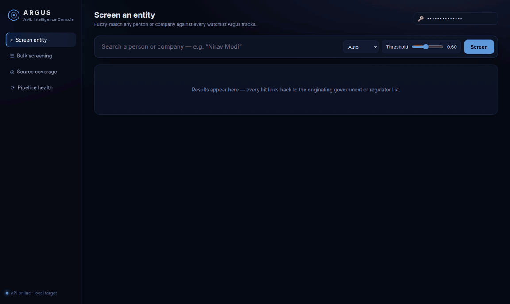

<sub><b>Argus Console</b>: screening a name against 12.2M records and browsing live source coverage. The data is real and the recording is unedited.</sub>

</div>

<br/>

<table>
<tr>
<td width="50%">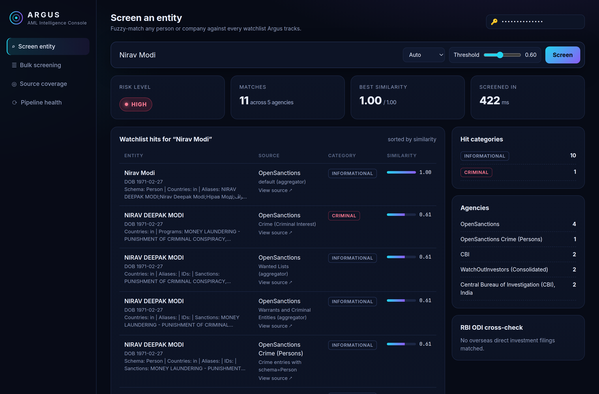<p align="center"><sub><b>Entity screen</b>: HIGH risk in 192 ms, with Interpol Red Notice (via CBI), criminal-interest and wanted-list hits, each linked to its source</sub></p></td>
<td width="50%">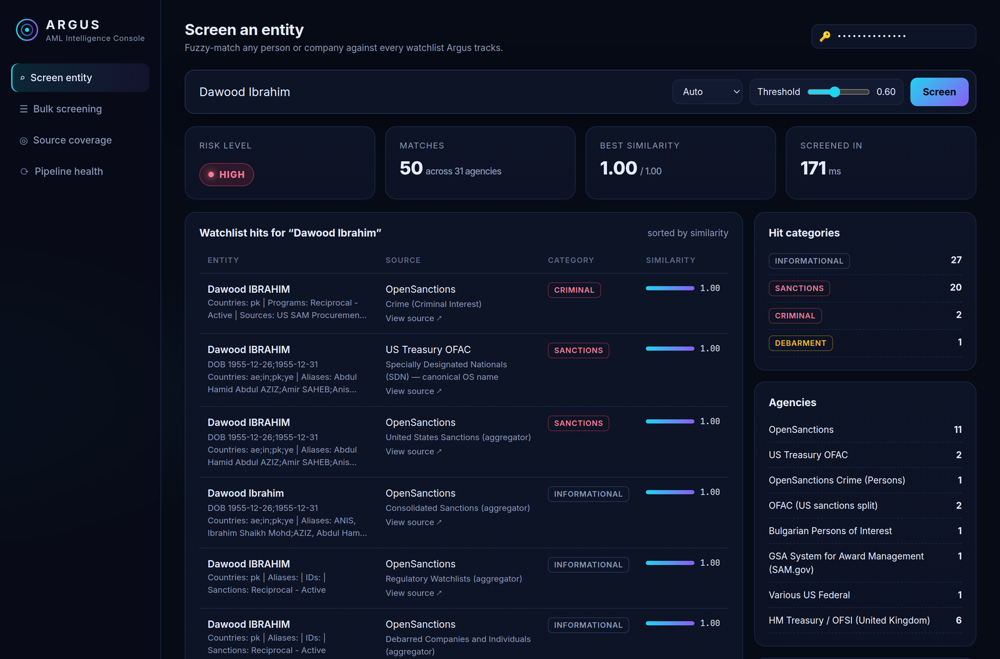<p align="center"><sub><b>Sanctions hit</b>: OFAC SDN, UK OFSI, the EU consolidated list and US narcotics designations</sub></p></td>
</tr>
<tr>
<td width="50%">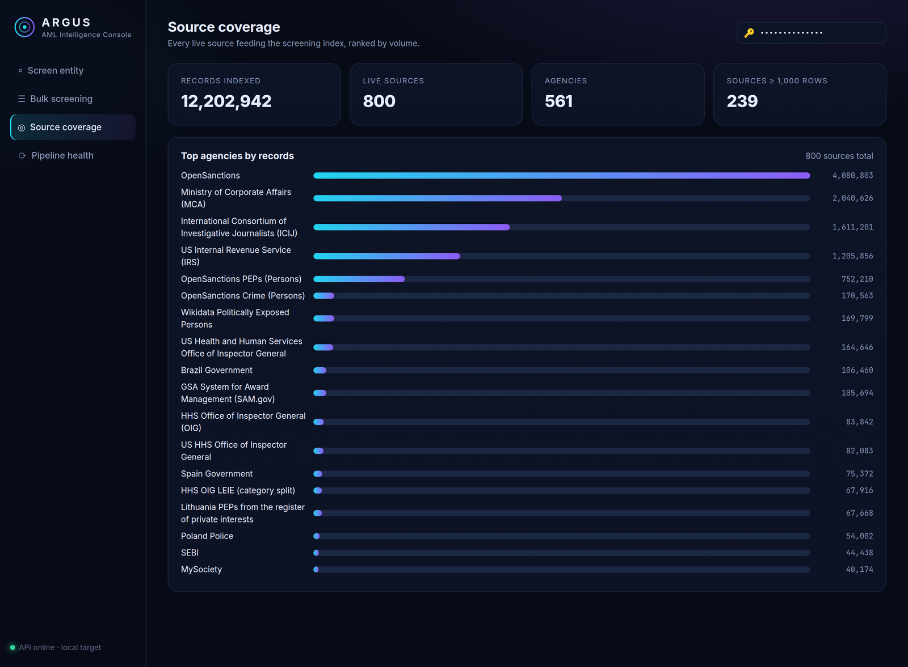<p align="center"><sub><b>Source coverage</b>: 12,202,942 records, 800 live sources, 561 agencies</sub></p></td>
<td width="50%">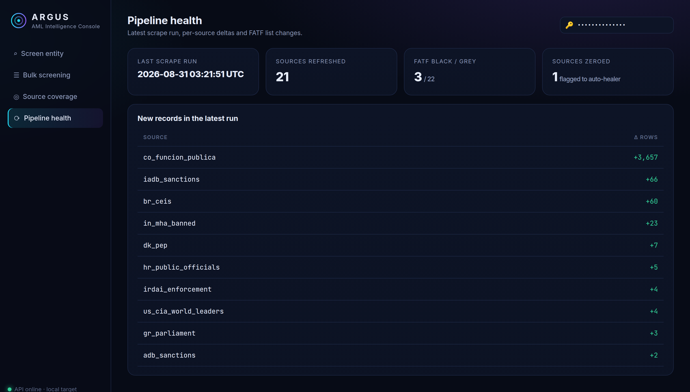<p align="center"><sub><b>Pipeline health</b>: last run, per-source deltas, FATF black/grey counts</sub></p></td>
</tr>
<tr>
<td width="50%">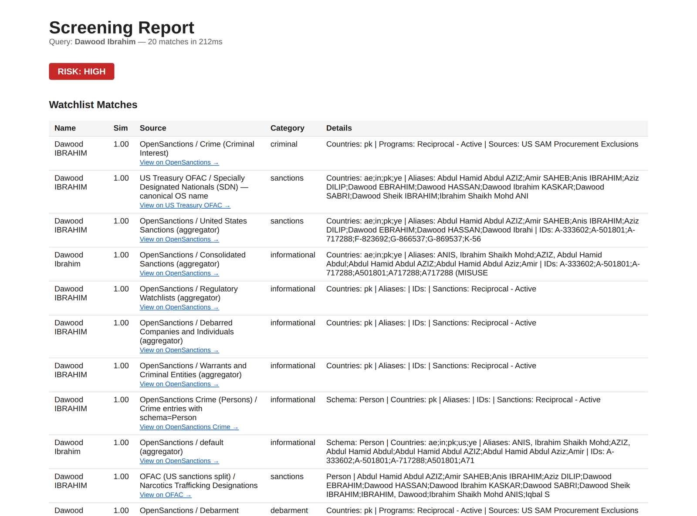<p align="center"><sub><b>Shareable HTML report</b>: <code>GET /api/screen/report/{name}</code></sub></p></td>
<td width="50%">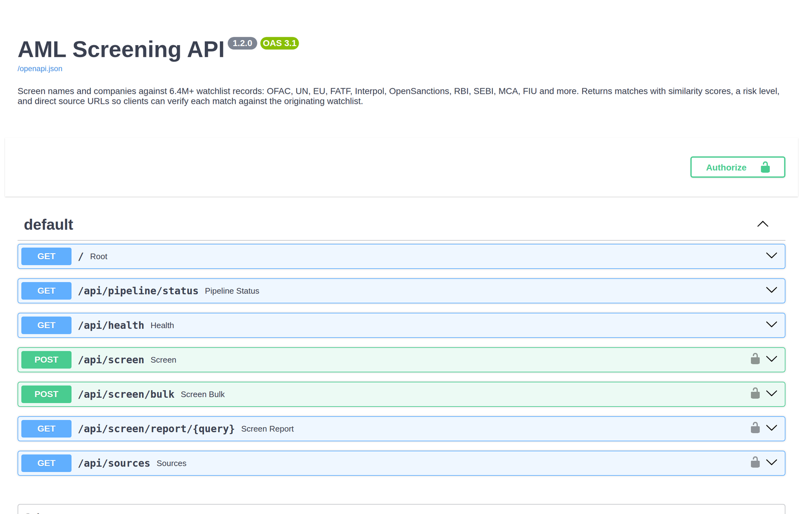<p align="center"><sub><b>Self-documenting API</b>: OpenAPI 3.1 with key-protected endpoints</sub></p></td>
</tr>
</table>

### One call, full answer

<div align="center">
</div>

---

## 🌍 Coverage

<div align="center">
</div>

<details>
<summary><b>Highlights by region: click to expand</b></summary>

<br/>

| Region | Sources include |
|---|---|
| **🇮🇳 India** | MCA (defaulting directors, struck-off and vanishing companies, ROC adjudications, corporate frauds), SEBI enforcement orders, NSE/BSE debarred and defaulting entities, NSDL/CDSL frozen PANs, bank wilful-defaulter lists (BoB, BoI, BoM, IOB…), CBI Red/Yellow notices and rewards, NIA most wanted, ED proclamations, MHA banned organisations and UAPA terrorists, FIU-IND high-risk and non-compliant NBFCs, IBBI, IRDAI, CCI, state police wanted lists, **RBI ODI overseas investments (104,688 filings, 2011–2026)** |
| **🇺🇸 United States** | OFAC SDN and consolidated lists, BIS entity lists, SAM.gov exclusions, HHS-OIG LEIE, FINRA and CFTC enforcement, IRS auto-revocations, FDIC failed banks |
| **🇪🇺 Europe / 🇬🇧 UK** | EU consolidated sanctions, UK OFSI, NCA most wanted, Companies House disqualified directors, Europol, BKA, national parliaments and PEP registers, FINMA, AMF, ESMA |
| **🌐 Multilateral** | UN Security Council, FATF black and grey lists, Interpol Red Notices, World Bank, ADB, AfDB, IDB and EBRD debarments |
| **🔓 Leaks** | ICIJ Panama, Paradise, Pandora, Bahamas and Offshore Leaks (1.61M entities, officers and intermediaries) |
| **🌎 Rest of world** | Latin America, Middle East, Africa, APAC: sanctions, PEPs and enforcement registers from 90+ jurisdictions |

</details>

<div align="center">
</div>

---

## 🏗 Architecture

<div align="center">
</div>

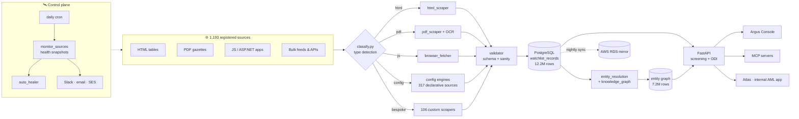

**Design principles** (from [`docs/architecture.md`](docs/architecture.md)):

1. **Classification first.** Each URL is classified once and routed to the right engine. Adding a source is a config change, not a code change.
2. **Graceful degradation.** One broken government website never stops the run. Failures are logged, alerted on and queued for healing.
3. **No silent failures.** Row-count drops, zeroed sources and stale scrapes trigger alerts before anyone downstream notices.
4. **Proof over probability.** A fuzzy match is only a lead. Argus always returns the source URL so a human can confirm it.

---

## 🔌 API

A FastAPI service (`api/screening_api.py`, v1.2.0) with API-key auth (`X-API-Key` header or `?api_key=`), a pooled PostgreSQL connection, structured JSON errors and request logging.

| Method | Endpoint | Purpose |
|---|---|---|
| `POST` | `/api/screen` | Screen one person or company. Accepts `type`, `threshold` (0.1–1.0) and `max_results` (≤200). |
| `POST` | `/api/screen/bulk` | Screen up to 50 names in one call. |
| `GET`  | `/api/screen/report/{query}` | Rendered HTML report, ready to share. |
| `GET`  | `/api/sources` | Live source catalogue with row counts (cached). |
| `GET`  | `/api/pipeline/status` | Last run, per-source deltas, FATF list changes. |
| `GET`  | `/api/health` | Liveness and DB target. |
| `GET`  | `/console` | The Argus web console. |

**RBI Overseas Direct Investment API** (`api/odi_api.py`): `/api/odi/search`, `/api/odi/company/{name}`, `/api/odi/stats`, `/api/odi/countries`, `/api/odi/export`. It covers **104,688 ODI filings from 2011 to 2026 with full monthly coverage**, and screening results are automatically cross-referenced against it.

**Risk verdict:** `HIGH` for sanctions, criminal or FATF-black hits. `MEDIUM` for PEP, debarment, enforcement, leaks or FATF-grey. `LOW` for informational or ODI-only hits. `CLEAR` when nothing matches.

Full reference: [`docs/api/`](docs/api/), including endpoints, response schema, integration notes and real example payloads.

### 🤖 MCP servers: plug Argus into any AI agent

| Server | Tools |
|---|---|
| `mcp_servers/screening_mcp_server.py` | `screen_name`, `screen_bulk` |
| `mcp_servers/odi_mcp_server.py` | `odi_company_lookup`, `odi_country_analysis`, `odi_stats` |

Point any MCP-compatible client (Claude Desktop, Claude Code, IDE agents) at these servers. Your AI assistant can then run compliance checks mid-conversation, grounded in 12.2M real records.

---

## 🧠 Engineering deep-dive

<details open>
<summary><b>Ingestion at 800-source scale</b></summary>

- **`classify.py`** probes every URL once (HTTP status, content type, DOM shape) and assigns `html | pdf | js | restricted | dead`. Sources without a known URL get **automatic URL discovery** on the agency's site.
- **Four generic engines**: HTML tables and repeating blocks, PDF (pdfplumber with Tesseract OCR fallback), JS via a stealth browser, and an ASP.NET postback handler. Recorded **API-replay recipes** (`recipes/`, 28 captured request flows) handle XHR-driven portals.
- **Config engines** (`engines/config_engines/`) let **317 sources be declared as JSON** covering the API endpoint, table selector, file download, field mapping and validation, with zero Python per source.
- **106 bespoke scraper modules** handle high-value sources that need precise extraction: CBI Red Notices, SEBI orders, MCA registers, bank wilful defaulters, state police, FIU, IBBI and more.
- **Bulk loaders** move multi-million-row feeds (OpenSanctions, ICIJ, IRS, a 1.46M-row MCA dump) with **index-swap fast loading** (`scripts/fast_load_with_index_swap.py`).

</details>

<details>
<summary><b>Self-healing operations</b></summary>

- **Daily pipeline** (`run_all.sh` → `scripts/daily_pipeline.sh`): scrape, validate, load, diff, report.
- **Per-source change detection**: a SHA-256 of the data-bearing DOM element skips unchanged sources, and `smart_change_detector.py` adds a smarter structural diff.
- **`monitor_sources.py`** stores daily per-source snapshots in `source_health` and classifies each source as `BROKEN` (dropped to 0), `ANOMALY` (dropped >50%), `STALE` (older than 7 days) or `NEW`.
- **`auto_healer.py`** reads monitor alerts and **acts on them**: it re-runs the scraper, reloads the source into local and RDS, and keeps a skip list for sources that are known to be down.
- **Alerting** goes to Slack, SMTP email and AWS SES. There is also a daily summary report (`send_daily_report.py`).
- **Local ↔ RDS parity checks** (`compare_counts.py`, `sync_rds_gap.py`) keep the cloud mirror row-for-row identical.

</details>

<details>
<summary><b>Entity resolution & knowledge graph</b></summary>

- **`entity_resolution.py`** clusters records that describe the same real-world entity *across different agencies*, using four strategies in priority order: `EXACT` (1.00) → `TOKEN` bag (0.90) → `SUBSET` (0.70) → `TRIGRAM` (pg_trgm ≥ 0.50).
- It avoids O(N²) comparisons with **3-character token blocking**, and only compares records that share a block and come from different sources.
- **`knowledge_graph.py`** builds `entity_groups` and `entity_links` with a **star topology**. A name found in 32 sources produces 31 links, not 496. All heavy work runs in-database via `INSERT … SELECT`, and no rows are pulled into Python.
- Result: **5,359,985 links across 1,823,485 entity groups**. 1.42M of those groups carry a `HIGH` risk level.

</details>

<details>
<summary><b>Screening engine</b></summary>

- Unicode-normalised, punctuation-stripped name matching with **pg_trgm** similarity over the full index. A typical query returns in **~70–550 ms**.
- Hits are categorised (`sanctions · criminal · pep · enforcement · debarment · leak · jurisdiction_risk · informational`) and aggregated into one verdict.
- **FATF jurisdiction flagging** and **RBI ODI cross-reference** run on every screen.
- Input validation, a 50-name bulk cap, a bounded connection pool with a 503 back-off signal, and structured error envelopes.

</details>

<details>
<summary><b>MCA company enrichment</b></summary>

`scripts/mca_enrichment.py` extracts every CIN mentioned anywhere in the index and enriches it with company master data: status, incorporation, capital, and defaulter, vanishing or dormant flags. It scores each company `HIGH / MEDIUM / LOW` and stores the result in `mca_company_enrichment` with a full JSON audit trail. The run is resumable, rate-limited and commits after every CIN.

</details>

---

## 🗄 Data model

| Table | Rows | Role |
|---|---:|---|
| `watchlist_records` | **12,202,942** | The screening index: name, aliases, DOB, address, details, source agency and list, document and detail-page URLs |
| `entity_links` | 5,359,985 | Cross-source edges of the knowledge graph |
| `entity_groups` | 1,823,485 | Resolved real-world entities with risk level and signals |
| `rbi_odi_investments` | 104,688 | RBI overseas direct investment filings, 2011–2026 |
| `entity_clusters` | 7,035 | Multi-strategy resolution clusters |
| `mca_company_enrichment` | 2,352 | CIN-level company risk enrichment |
| `source_health` | 1,232 | Daily per-source health snapshots |

**≈ 19.5 million rows · ~13 GB** in PostgreSQL, mirrored to AWS RDS.

---

## 🚀 Quickstart

```bash
git clone https://github.com/Aaayyuusshhh/argus-aml-intelligence-engine.git
cd argus-aml-intelligence-engine

python3.12 -m venv venv && source venv/bin/activate
pip install -r requirements.txt
sudo apt install tesseract-ocr poppler-utils        # OCR for PDF sources

cp .env.example .env                                # fill in DB + API keys
python scripts/setup_db.py                          # create schema

./run_all.sh                                        # full scrape → load → report
uvicorn api.screening_api:app --port 8002           # API + console at /console
```

```bash
# screen a name
curl -s -X POST localhost:8002/api/screen \
  -H "X-API-Key: $SCREENING_API_KEY" -H "Content-Type: application/json" \
  -d '{"name": "Nirav Modi"}' | jq '.risk_level, .total_matches'
```

---

## 📁 Repository layout

```
.
├── api/                  FastAPI services: screening + RBI ODI
├── console/              Argus web console (single-file SPA, served at /console)
├── mcp_servers/          MCP tool servers for AI agents
├── classify.py           URL classifier and router
├── main.py               Pipeline orchestrator
├── engines/              Generic HTML / PDF / browser / ASP.NET engines
│   └── config_engines/   Declarative JSON-driven source engines
├── handlers/             Dispatch layer (custom scraper → generic engine fallback)
├── scrapers/             106 bespoke high-value scrapers
├── configs/sources/      317 declarative source definitions
├── recipes/              Captured API-replay request recipes
├── scripts/              Loaders, monitor, auto-healer, entity resolution, enrichment
├── utils/                Change detection, alerting, logging, request recipes
├── sources.json          Master registry: 1,193 sources
├── data/rbi_odi/         RBI ODI monthly source files (2011–2026)
└── docs/                 Architecture, PRD, runbooks, API reference, assets
```

---

## 🧰 Tech stack

**Python 3.12** · **FastAPI / Uvicorn** · **PostgreSQL + pg_trgm** · **Scrapling** (incl. stealth browser fetcher) · **Playwright** · **pdfplumber** · **Tesseract OCR / pdf2image** · **pandas / openpyxl** · **psycopg2** (pooled) · **Model Context Protocol** · **AWS RDS · EC2 · SES** · **Slack webhooks** · **cron / bash**

---

## 🔐 Security

- No credentials live in source. Everything is read from the environment or `.env` (see [`.env.example`](.env.example)), with `~/.pgpass` as a fallback.
- Screening endpoints require an API key. Callers should proxy through their own backend and never ship the key to a browser.
- Argus only indexes **publicly published** government, regulator and journalistic records, and every hit is attributed to its source.

---

<div align="center">

**Built by [Aayush Katyal](https://github.com/Aaayyuusshhh)** at Resurgent India

<sub>© 2026 Aayush Katyal. All rights reserved. The source is shared for reference and portfolio review.</sub>

</div>
